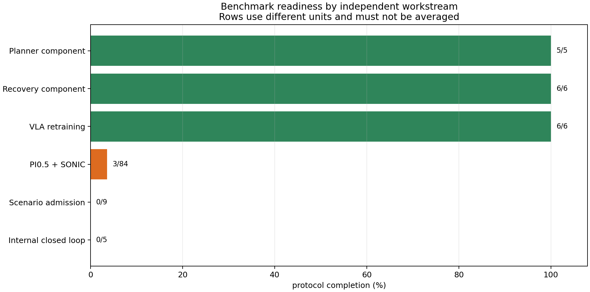

# Benchmark completion status

This file is the persistent source of truth for finishing the pre-`ours`
benchmark. Update it whenever a pipeline stage starts, stops, fails, or reaches
a frozen evidence revision. Do not infer paper readiness from branch names.

Last audited: **2026-09-15 (Asia/Bangkok)**.

## Current state

| Workstream | Finished | Still required for a paper claim |
| --- | --- | --- |
| Planner component | 5/5 algorithm variants, symbolic/Cosmos evaluation | Matched closed-loop rollout of the registered methods |
| Recovery component | 6/6 mechanism variants, symbolic fault injection | Admitted simulator failures and end-to-end recovery rollout |
| VLA retraining | 6/6 training seeds, 42 held-out trajectories × 5 conditions | Closed-loop task and recovery success; open-loop MSE is not SR/RSR |
| External HumanoidArena | 3/84 formally complete cells; 65/1680 valid episode JSONs observed | Finish the locked PI0.5+SONIC matrix; treat OpenDoor separately until its upstream contract is fixed |
| Scenario admission | 0/9 scenarios | Immutable snapshot/injector/predicate evidence and independent oracle 20/20 per scenario |
| Internal controlled matrix | 0/5 registered methods; HA state64/action40 train/validation/hidden bridge passed on 700 episodes and the HTTP inference contract is implemented, common checkpoint/real-model server validation still pending | Train the shared bridge and run `gr00t_sonic`, `gr00t_st`, `gr00t_st_rt`, `gr00t_str`, and `gr00t_str_rt` on identical cells |

The first interrupted external run completed `base_test/boxing/seed-0` and
`seed-1`. It also left 11 valid atomic episode records for seed 2. The optimized
resume completed the remaining nine records, formally closed the third cell,
and entered `semantic/boxing` at 2026-09-15 06:02 UTC without reloading its
task-shared policy server. At the last audit it had produced 65 valid episode
records. This is explicitly `partial_non_claim` evidence, not a result table.
The mutable machine progress file is authoritative after this tracked checkpoint.



## Frozen scope before `ours`

The benchmark is complete only when every applicable box below is checked. This
is deliberately finite: adding more unrelated papers is not part of the exit
condition.

- [x] Lock upstream source, model, dataset, controller, and simulator revisions.
- [x] Register the five internal ablation rows and their exact component changes.
- [x] Retain raw planner, recovery, multi-seed retraining, Isaac Sim, video, and
  hardware evidence with honest claim boundaries.
- [x] Publish selected final checkpoints and datasets to immutable Hugging Face
  revisions; keep hashes in Git.
- [ ] Finish all 84 external PI0.5+SONIC cells: 7 tasks × 4 modes × 3 seeds × 20
  rollouts. The six upstream-valid tasks form the primary aggregate. OpenDoor is
  a diagnostic/appendix row unless its two locked upstream contract tests pass
  before results are inspected.
- [ ] Implement and validate the HumanoidArena 40-D action bridge for the five
  GR00T/SONIC internal methods. The existing Arena G1 retrains use a different
  43-DoF/direct-action contract and cannot be presented as HumanoidArena reruns.
- [ ] Materialize the nine recovery scenarios with deterministic semantic-event
  injectors, snapshots, predicates, and exact hashes.
- [ ] Pass independent oracle admission at 20/20 for every included scenario.
- [ ] Freeze development/validation cells and a hidden final-test plan before
  creating or tuning `ours`.
- [ ] Run all five internal methods on the identical plan with 3 training seeds
  and 20 rollout seeds per cell. Never pool `nominal`, `failure_start`, and
  `online_failure`.
- [ ] Report SR, macro RSR, RD, RC, L-level/H-axis slices, fall and safety rates,
  detection precision/recall/F1, recovery time, policy latency, wall time,
  CPU/GPU utilization, and peak memory.
- [ ] Attach Wilson intervals, paired McNemar tests, Holm correction, effect
  sizes, and a power analysis. Increase repeats if the predeclared power target
  is not met.
- [ ] Make `claim-readiness` and `audit-evidence` exit zero; verify every artifact
  hash and retain representative success/failure videos and Isaac Sim frames.
- [ ] Tag the frozen pre-`ours` state as `benchmark/hrvla-v1-frozen`. Create the
  future `ours` branch only from that tag.

## Comparison table contract

| Row | What is compared directly | Evidence status |
| --- | --- | --- |
| PI0.5 + SONIC | Released HumanoidArena task checkpoints under the locked 84-cell protocol | Running; partial non-claim |
| GR00T + SONIC | No subtask planner, no recovery, no project retraining | Registered; closed-loop pending |
| GR00T-ST | Adds the subtask planner only | Registered; closed-loop pending |
| GR00T-ST-RT | Adds in-domain post-training to ST | Open-loop complete; closed-loop pending |
| GR00T-STR | Adds transition-aware recovery to ST | Component complete; closed-loop pending |
| GR00T-STR-RT | Adds recovery-conditioned post-training to STR | Open-loop complete; closed-loop pending |
| `ours` | Future contribution against the frozen rows above | Must not start until the frozen tag exists |

τ0-VLA, Vesta, Anticipation-VLA, STEP Planner, Hi Robot, BATON, AgentChord,
ReKep, DoReMi, Inner Monologue, ReSYNC, Dream2Fix, LIBERO-RECOVER, Pro-HOI,
OmniContact, SUGAR, and HumanoidExo remain paper-reported context unless their
official artifacts are rerun under the same observation/action/controller and
episode contract. A proxy implementation must never be labeled an official
paper rerun.

## Live pipeline and reproducible commands

The optimized external runner keeps one exact CPU PI0.5 server per task and one
persistent Isaac Sim process per mode. It resumes finished episode IDs, records
one representative video per ten scheduled episodes, disables diagnostic tensor
dumps, and captures five-second hardware telemetry. The scientific contract is
unchanged; only orchestration and non-metric I/O differ.

```bash
python3 -u scripts/run_humanoidarena_baseline_matrix_fast.py \
  --cpu-threads 24 --compile-threads 32 --interop-threads 2

python3 scripts/summarize_humanoidarena_baseline_matrix.py --allow-partial
python3 scripts/render_benchmark_evidence.py
PYTHONPATH=src python3 -m pytest -q
```

During execution, machine-live progress is written to
`_artifacts/HumanoidArena/paper-baselines/pi05-sonic/progress.json`; hardware
samples are appended to `hardware-telemetry.jsonl`. Both are ignored while
mutable. At a milestone or clean completion, regenerate the compact tracked
summary and plots under `results/`, update this file, commit, and push `main`.

## Resource rule

The RTX 5070 Ti has 16,303 MiB VRAM. Isaac Sim plus SONIC uses roughly 6–7 GiB,
while the exact float32 PI0.5 policy parameters alone use 9,353,976,928 bytes,
before activations. Running both fully on the GPU has no safe memory margin.
Therefore the locked baseline keeps PI0.5 on CPU and reserves CUDA for physics,
rendering, and SONIC. Quantization or reduced precision would be a different
baseline and requires a separately labeled ablation. “Maximum hardware” means
maximum safe throughput under the unchanged scientific method, not an unsafe
utilization target.

A fixed-input steady-state profile on the i9-14900K measured median PI0.5
request latency of 23.72s, 29.18s, 17.52s, and 40.24s at 8, 16, 24, and 32
intra-op threads respectively. The pipeline therefore uses 24 policy threads;
this is 2.30× faster than forcing all 32 logical threads. The remaining cores
serve Isaac Sim, I/O, and orchestration. See the
[profile JSON](results/benchmark/performance/pi05_cpu_thread_profile.json) and
[thread-scaling plot](results/benchmark/performance/pi05_cpu_thread_scaling.png).

## Stop/restart log

- 2026-09-15: stopped legacy PID `331152` and its benchmark-only process group
  after SIGTERM did not drain children. No unrelated process was killed.
- 2026-09-15: retained all 51 finished episode JSONs and their videos; no partial
  result was promoted to a claim.
- 2026-09-15: replaced cell-local server startup with task-shared server
  orchestration to reduce policy loads from at most 84 to 7 and simulator starts
  from at most 84 to 28 for a fresh full run.
- 2026-09-15 05:28 UTC: started the optimized full-matrix resume as PID `1551582`
  with 24 policy threads, 32 compile threads, two inter-op threads, and five-second
  telemetry. After the first valid new result, the driver, policy server, and
  simulator were raised from inherited `nice=5` to normal `nice=0`; future child
  processes inherit the corrected priority. No unrelated process was reprioritized.
- 2026-09-15 06:02 UTC: completed the resumed `base_test/boxing/seed-2` cell and
  entered `semantic/boxing`. The task-shared PI0.5 server remained alive across
  the mode boundary, validating the intended reload-elimination path.

See [the local storage cleanup ledger](docs/LOCAL_STORAGE_CLEANUP.md),
[the benchmark protocol](docs/BENCHMARK.md), and
[the artifact contract](docs/ARTIFACTS.md). The internal action-interface work
is tracked in [the HumanoidArena 40-D GR00T bridge note](docs/HUMANOIDARENA_GR00T_BRIDGE.md).
