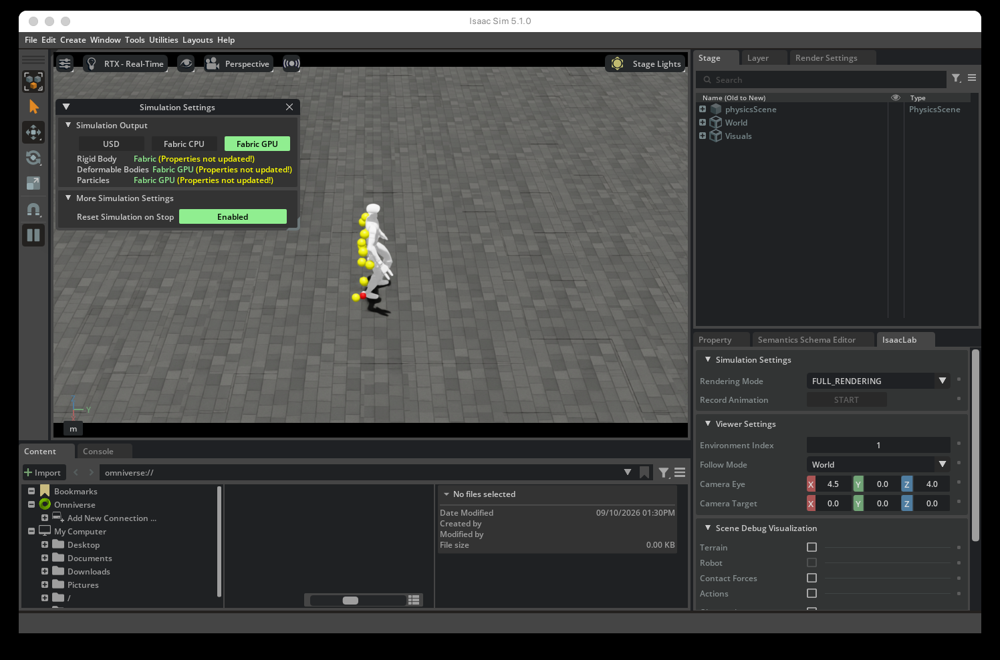

# HRVLA recovery benchmark

This repository defines the evaluation contract for comparing HRVLA with official
baselines and integrates it with the ST/STR implementation. It intentionally
contains no pre-filled paper results and makes no claim that unlike tasks are
directly comparable.

The benchmark separates three questions:

1. `nominal`: does adding recovery preserve normal task execution?
2. `failure_start`: can a method recover when every method starts from the same
   post-failure simulator snapshot?
3. `online_failure`: can the complete system detect, diagnose, recover, and
   continue after the same event-triggered failure injection?

Recovery difficulty follows LIBERO-RECOVER's L1-L4 taxonomy. Humanoid-specific
body/tracker failures are an orthogonal H1-H3 axis, not invented L5-L7 levels.

## Validate the specification

```bash
python3 -m json.tool benchmark/spec/episode.schema.json >/dev/null
python3 -m json.tool benchmark/spec/plan.schema.json >/dev/null
python3 -m json.tool benchmark/spec/run-manifest.schema.json >/dev/null
python3 -m json.tool benchmark/suites/hrvla_recovery_v0.json >/dev/null
python3 -m json.tool benchmark/baselines/registry.json >/dev/null
PYTHONPATH=src python3 -m unittest discover -s tests -v
```

Generate a deterministic paired plan and provenance manifest (draft scenarios
are excluded unless explicitly requested):

```bash
python3 scripts/benchmark.py plan benchmark/suites/hrvla_recovery_v0.json \
  --method gear_sonic_original_release --method hrvla \
  --output outputs/plan.json --manifest outputs/run-manifest.json
```

Before any claim-bearing run, require the suite admission audit to exit zero:

```bash
python3 scripts/benchmark.py claim-readiness \
  benchmark/suites/hrvla_recovery_v0.json \
  --output outputs/claim-readiness.json
```

The current v0 suite intentionally fails this gate while simulator snapshots,
predicate tests, injector revisions, and 20/20 oracle trials are pending. A draft
run may still be used for harness development, but cannot become publication
evidence.

## Score episode records

```bash
python3 scripts/benchmark.py score path/to/episodes.jsonl \
  --output outputs/summary.json
```

After every method has run the same frozen plan, verify exact paired coverage and
the shared controller/simulator contract before scoring:

```bash
python3 scripts/benchmark.py audit-evidence outputs/plan.json \
  outputs/baseline.jsonl outputs/candidate.jsonl \
  --output outputs/evidence-audit.json
```

See [`docs/BENCHMARK.md`](docs/BENCHMARK.md) for fairness rules, metrics, and the
boundary between direct reruns and paper-reported reference results.

Large checkpoints and prepared dataset splits are mapped to their exact local and
Hugging Face locations in [`docs/ARTIFACTS.md`](docs/ARTIFACTS.md). The checked-in
artifact lock provides file size and SHA-256 verification for the selected ST-RT
and STR-RT step-300 checkpoints and both deterministic dataset splits.

The runnable baseline matrix is frozen in
[`benchmark/methods/registry.json`](benchmark/methods/registry.json). It preserves
the project taxonomy (`ST`, `STR`, and `RT`) and predeclares the four controlled
comparisons used to isolate planning, recovery, and retraining contributions.

## Validated SONIC backend

This branch includes the locked GEAR-SONIC reproduction used as the benchmark
execution backend. On the RTX 5070 Ti workstation, Isaac Sim 5.1.0 and Isaac
Lab 2.3.2 completed both bundled walk-forward motions (`4,004` frames) without
termination. The [machine-readable result](results/sonic-default-sample.json),
[runtime instructions](docs/SONIC_BASELINE.md), and source/artifact lock files
are part of the benchmark provenance.

The executed controller-track artifacts are committed under
[`results/benchmark/`](results/benchmark/): nominal SONIC motion tracking and an
audited one-shot H1 lateral-push diagnostic. Raw simulator metrics are retained
beside their scored reports so every recorded SHA-256 can be checked locally.



## Long-horizon subtask planning

This branch adds an independent implementation of a selective, world-model-guided
test-time-compute planner. It decomposes a large instruction into one executable
language subtask at a time, verifies it against observed affordances, and sends that
bounded instruction through GR00T's existing language input. The 64-dimensional
GR00T/SONIC action contract is not changed.

Validate the benchmark and run all five algorithm variants:

```bash
python3 scripts/subtask_planner.py validate
python3 scripts/subtask_planner.py simulate \
  --output-dir results/subtask/cpu-noise-028 \
  --episodes-per-task 1000 --workers 0 --proposal-error-rate 0.28
```

Evaluate real NVIDIA Cosmos-Reason2-2B proposals on GPU with a local snapshot:

```bash
_vendor/Isaac-GR00T/.venv/bin/python scripts/subtask_planner.py gpu-eval \
  --model-path "$COSMOS_REASON2_SNAPSHOT" \
  --output-dir results/subtask/cosmos-reason2
```

See [`docs/SUBTASK_PLANNER.md`](docs/SUBTASK_PLANNER.md) for the algorithm,
paper comparison, metric definitions, integration contract, and limitations.
Measured CPU/GPU/SONIC results and negative findings are in
[`docs/SUBTASK_RESULTS.md`](docs/SUBTASK_RESULTS.md).

## Transition-aware subtask recovery

The recovery coordinator catches a declared subtask failure, gates recovery on
observed readiness, and selects a corrective primitive whose exit satisfies the
interrupted task's handoff contract. Its BATON-inspired transition memory operates
above the same GR00T language adapter and leaves SONIC's action interface unchanged.

Validate the protocol and run the paired-seed recovery benchmark:

```bash
python3 scripts/subtask_recovery.py validate
python3 scripts/subtask_recovery.py simulate \
  --output-dir results/recovery/cpu-fault-015 \
  --episodes-per-task 3000 --workers 32 --disturbance-rate 0.15
```

Evaluate 20 independent candidate sets from the locked Cosmos-Reason2-2B snapshot:

```bash
_vendor/Isaac-GR00T/.venv/bin/python scripts/subtask_recovery.py gpu-eval \
  --model-path "$COSMOS_REASON2_SNAPSHOT" \
  --output-dir results/recovery/cosmos-reason2-r20 \
  --candidates-per-failure 3 --repetitions 20
```

See [`docs/SUBTASK_RECOVERY.md`](docs/SUBTASK_RECOVERY.md) for the algorithm,
paper comparison, metric definitions, and safety boundary. The measured report,
retained raw traces, charts, Cosmos outputs, SONIC metrics, video, and Isaac Sim
frames are indexed by
[`docs/SUBTASK_RECOVERY_RESULTS.md`](docs/SUBTASK_RECOVERY_RESULTS.md).

Run the low-level disturbance regression and record its Isaac Sim camera output:

```bash
python3 scripts/run_sonic_release.py metrics --inject-push --num-envs 32 \
  --output-dir results/recovery/isaacsim/sonic-push-32env
python3 scripts/run_sonic_release.py record --inject-push \
  --metrics-file results/recovery/isaacsim/sonic-push-32env/metrics_eval.json \
  --output-dir results/recovery/isaacsim/push-recording
```

## In-domain VLA post-training

The subtask-conditioned GR00T N1.7 action decoder was post-trained on a
leakage-resistant 166/42 episode split of NVIDIA's Isaac Lab G1 pick-and-place
data. Paired evaluation across all held-out episodes and five observation
conditions reduces clean action MSE by 4.988%; per-phase results also retain the
approach/grasp regressions. The experiment includes immutable inputs, raw
hardware telemetry, checkpoint trends, statistical tests, Isaac Lab evidence,
and a fresh recorded Isaac Sim/SONIC regression.

See [`docs/SUBTASK_VLA_RETRAINING.md`](docs/SUBTASK_VLA_RETRAINING.md) for the
exact training scope, commands, metrics, plots, videos, and claim boundaries.

## Recovery-conditioned VLA post-training

A second GR00T N1.7 action-decoder checkpoint is trained with recovery-conditioned
instructions on the same leakage-resistant G1 split. Across all 42 held-out
episodes it reduces clean action MSE by 5.612% versus the calibrated base and by
0.477% versus the subtask-post-trained model. The retained per-phase analysis
also exposes approach/grasp regressions relative to the base.

See [`docs/RECOVERY_VLA_RETRAINING.md`](docs/RECOVERY_VLA_RETRAINING.md) for the
three-model statistics, hardware telemetry, failed probe, plots, visual evidence,
and end-to-end claim boundary.
