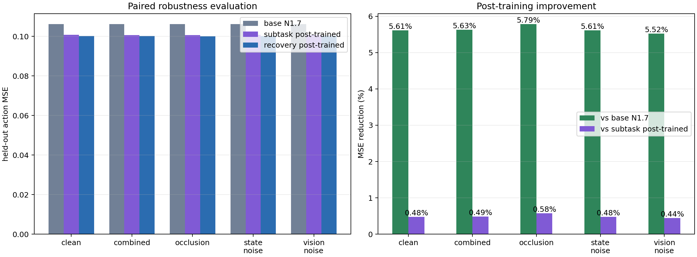
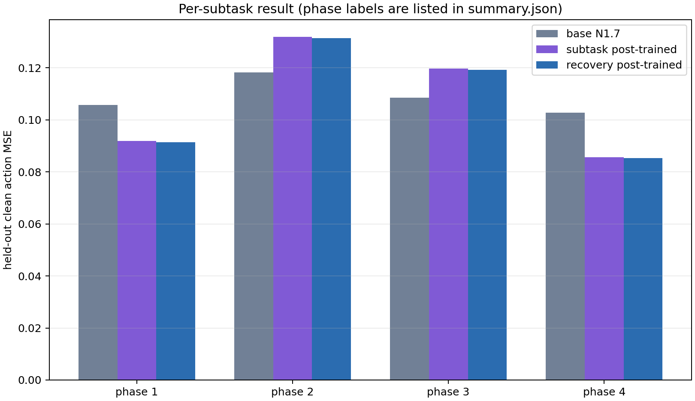
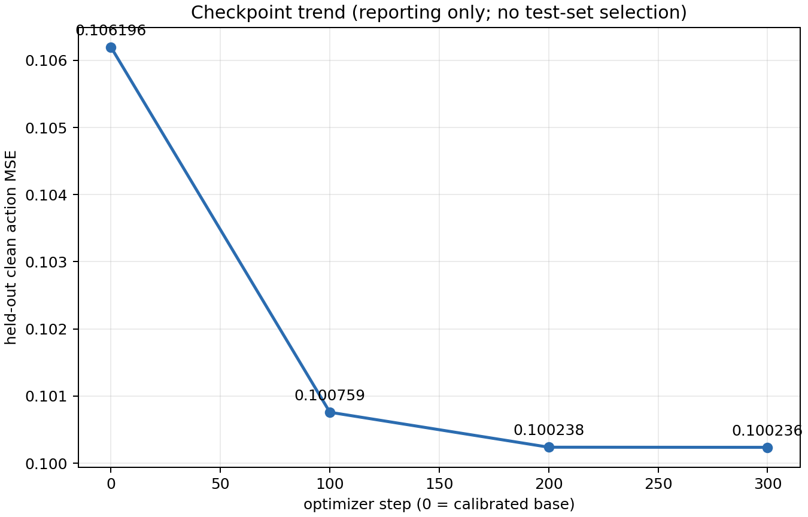
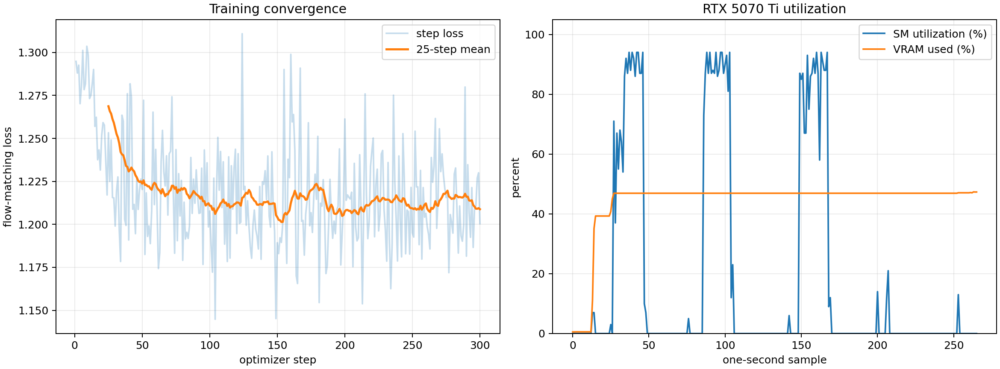
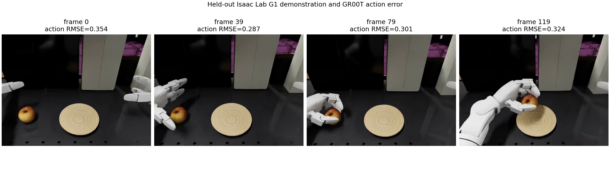

# Recovery-conditioned VLA post-training

This experiment adds low-level GR00T N1.7 post-training to the transition-aware
recovery branch. It compares the calibrated base model, the subtask-post-trained
checkpoint from commit `9dd8a74`, and a separately recovery-conditioned
checkpoint on the same held-out trajectories and seeds.

The higher-level recovery coordinator remains the BATON-inspired implementation
documented in [`SUBTASK_RECOVERY.md`](SUBTASK_RECOVERY.md). Its research cutoff,
BATON/ReSYNC/AgentChord/Dream2Fix/ReKep/DoReMi/Inner Monologue comparison, and
324,000-episode evaluation remain unchanged and fully retained.

## Training scope and data boundary

As in the subtask experiment, the 16 GiB workstation cannot run NVIDIA's
documented 40 GiB full fine-tuning profile. The run trains the
embodiment-conditioned final action decoder in FP32 while freezing the Cosmos
vision/language backbone and flow-matching core in BF16. It updates 37,916,800
of 3,144,016,000 parameters (1.206%) and produces standard GR00T checkpoints.
This is real VLA action-decoder adaptation, not full-backbone fine-tuning.

The data source is NVIDIA's 208-episode Isaac Lab G1 pick-and-place release at
revision `37ba80a99486a4c308477854f54b4e82e77777dc`. The same episode-level
166/42 train/held-out split and 40-step horizon are used as the subtask run.
Recovery wording is attached to the horizon-aligned close/release phases:

1. recover a missed grasp by re-approaching;
2. align and recover the grasp;
3. stabilize and transport the recovered apple;
4. complete placement and retract safely.

These are counterfactual recovery-conditioned labels placed on successful
demonstrations. They are not recorded fail-then-recover demonstrations and
cannot establish physical recovery success. The complete dense-ID remap,
episode split, and phase audit are in
[`split_manifest.json`](../results/retraining/recovery/dataset/split_manifest.json).

## Hardware-aware run

The production run used batch 16, accumulation 1 (effective batch 16), 16 data
workers on the i9-14900K, fused AdamW, BF16/TF32, color jitter, state dropout
0.35, and seed 42.
Per-worker `OMP_NUM_THREADS=1` and `MKL_NUM_THREADS=1` prevent nested thread-pool
oversubscription. PyArrow preparation used 353% CPU; training CPU aggregate busy
reached 83.52% (p95 74.324%). GPU SM reached 94% (p95 93.75%), board power 214 W,
and framebuffer allocation 7,720 MiB.

Training completed 300 optimizer steps in 278.76 seconds wall time; trainer
runtime was 199.999 seconds at 24.0 samples/s and 1.5 optimizer steps/s including
checkpoint saves. Maximum main-process RSS was 10.48 GB. Mean loss fell from
1.268696 over the first 25 steps to 1.208828 over the last 25 (-4.719%).

An earlier batch-16/28-worker probe completed forward/backward work but received
`SIGKILL` while all workers were caching shards during its immediate checkpoint
save. The production run retained batch 16 and reduced workers to 16; all three
checkpoints then saved successfully. Both failed-probe logs are retained under
[`probes/batch16-28-workers`](../results/retraining/recovery/probes/batch16-28-workers/),
and the complete remote probe directory has not been deleted.

## Three-model held-out evaluation

All models use the recovery language labels and identical normalization,
trajectory IDs, corruption seeds, four denoising steps, and 120 frames per
trajectory. Each condition contains 42 paired trajectories.

| Condition | Base MSE | Subtask model | Recovery model | Recovery vs base | Recovery vs subtask |
| --- | ---: | ---: | ---: | ---: | ---: |
| Clean | 0.106196 | 0.100717 | **0.100236** | 5.612% | 0.477% |
| Vision noise | 0.106213 | 0.100791 | **0.100346** | 5.523% | 0.442% |
| Occlusion | 0.106179 | 0.100616 | **0.100036** | 5.786% | 0.576% |
| State noise | 0.106196 | 0.100715 | **0.100234** | 5.614% | 0.478% |
| Combined | 0.106186 | 0.100696 | **0.100205** | 5.633% | 0.487% |

For clean MSE versus the calibrated base, all 42 trajectories improve; the mean
paired reduction is 0.005960, bootstrap 95% CI [0.005325, 0.006577], exact sign
test `p=4.55e-13`, and paired `dz=2.830`. Against the already post-trained
subtask model, 38/42 improve; the mean reduction is 0.000481, CI [0.000382,
0.000574], `p=5.65e-8`, and `dz=1.481`. Mean clean inference latency is 53.05 ms.



The per-phase result remains mixed relative to the base. Recovery conditioning
improves transport by 16.998% and place/retract by 13.443%, but approach regresses
11.046% and grasp regresses 9.905%. Relative to the subtask-post-trained model,
the recovery model improves every phase by 0.385% to 0.553%. This supports a
small conditioning-specific benefit but also shows that successful-only data do
not solve early-stage recovery.



Checkpoint clean MSE is 0.106196 at step 0, 0.100759 at 100, 0.100238 at 200,
and 0.100236 at 300. Checkpoint 300 remains the predeclared final checkpoint;
all checkpoints and the reporting-only curve are retained.





## Visual and simulator evidence

The following image and neighboring MP4 are drawn from a held-out Isaac Lab G1
demonstration evaluated by the recovery-conditioned model. The overlay is based
on its predicted-versus-demonstrated action error. The MP4 is source evidence,
not a generated closed-loop policy rollout.



The recovery branch also retains fresh Isaac Sim 5.1 recordings for nominal and
periodic-push SONIC execution. Under push disturbance, all 32 environments remain
successful with progress 1.0; local MPJPE changes from 17.285 to 17.983 mm. See
[`SUBTASK_RECOVERY_RESULTS.md`](SUBTASK_RECOVERY_RESULTS.md) and the
[periodic-push video](../results/recovery/isaacsim/push-recording/render_results/000000.mp4).
That rollout proves low-level SONIC disturbance recovery, not apple-manipulation
recovery by this VLA. The public dataset does not include the matching task scene
and failure/recovery demonstrations required for a defensible end-to-end claim.

## Reproduction

Immutable inputs and exact hyperparameters are in
[`recovery_vla_retraining.lock.json`](../config/recovery_vla_retraining.lock.json).

```bash
HRVLA_ROOT=/HELIOS/Robotics/HRVLA
VLA_PYTHON="$HRVLA_ROOT/_vendor/Isaac-GR00T/.venv/bin/python"

"$VLA_PYTHON" scripts/prepare_vla_retraining_data.py \
  --source "$HRVLA_ROOT/_artifacts/datasets/arena-g1-static-pick-place/lerobot" \
  --output-root "$HRVLA_ROOT/_artifacts/datasets/arena-g1-recovery-split" \
  --heldout-fraction 0.2 --seed 42 --horizon 40 --recovery-labels

OMP_NUM_THREADS=1 MKL_NUM_THREADS=1 "$VLA_PYTHON" \
  scripts/train_gr00t_vla_adapter.py \
  --base-model-path "$HRVLA_ROOT/_artifacts/GR00T-N1.7-3B" \
  --dataset-path "$HRVLA_ROOT/_artifacts/datasets/arena-g1-recovery-split/train" \
  --modality-config-path config/g1_arena_subtask_config.py \
  --output-dir "$HRVLA_ROOT/_artifacts/retraining/str-action-decoder-b16-ga1-s300/checkpoints" \
  --max-steps 300 --save-steps 100 --global-batch-size 16 \
  --gradient-accumulation-steps 1 --dataloader-num-workers 16 \
  --learning-rate 5e-5 --seed 42 --state-dropout-prob 0.35 --color-jitter
```

Use `scripts/evaluate_vla_retraining.py` for each checkpoint and
`scripts/render_vla_retraining_results.py --reference-metrics ...` for the
three-model paired statistics and plots. Full checkpoints, calibrated baseline,
prepared datasets, and every probe remain below the remote artifact roots; the
compact audit set under `results/retraining/recovery` is tracked in Git.
