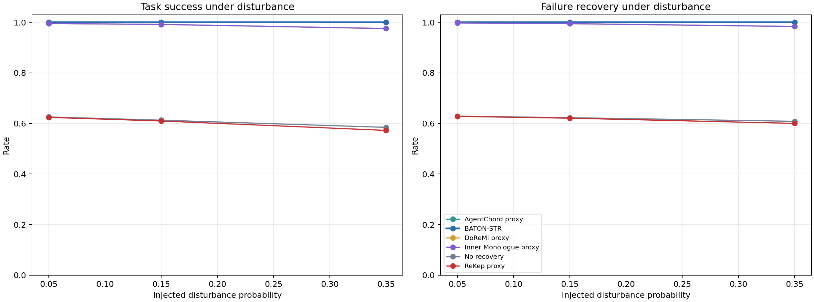
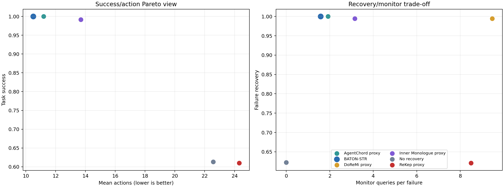
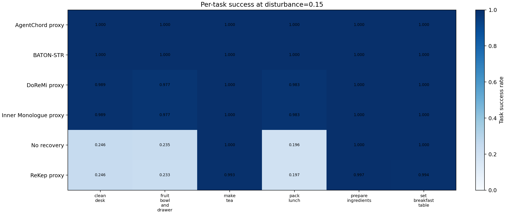
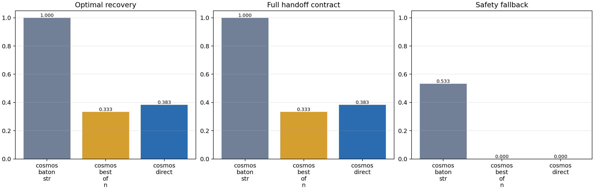
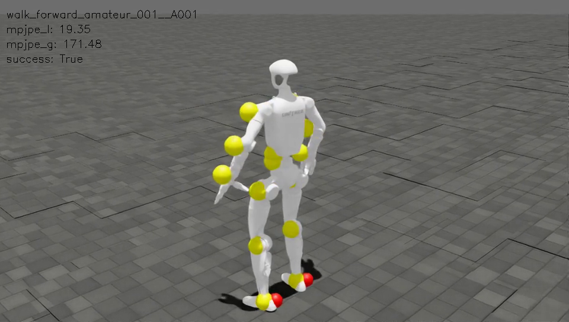

# Subtask recovery evaluation report

## Executive result

`baton_str` is the recommended recovery coordinator for this repository. Across
324,000 paired-seed symbolic episodes it is the only evaluated method that combines
near-perfect task completion, 100% observed failure recovery, a 100% handoff
contract rate, and the fewest executed actions among the high-success methods.

At the adverse disturbance rate 0.35, BATON-STR completes 99.9944% of 18,000
episodes (17,999/18,000) and recovers 100% of counted failure incidents. The
AgentChord proxy completes 99.9667% (17,994/18,000), but satisfies only 58.72% of
the handoff contract and uses 0.929 more actions per episode. The paired task-success
difference is five wins and no losses for BATON-STR; its two-sided exact McNemar
`p=0.0625`, so task success alone is not a statistically decisive advantage over
AgentChord at this ceiling. The paired action reduction has a normal 95% interval
of 0.889 to 0.969 actions and the full-contract advantage is operationally clear.

On 120 real Cosmos-Reason2-2B failure decision points, direct generation establishes
the complete handoff in 38.33% of cases and Best-of-3 in 33.33%. Applying the
transition gate, successor check, and deterministic safety fallback raises both
optimal-recovery selection and full handoff to 100%. This proves the coordinator's
contract on the included states; it does not prove universal physical recovery.

## Retained experiment volume

- 324,000 final symbolic episodes: 3 disturbance levels × 6 methods × 6 tasks ×
  3,000 paired seeds. All per-episode traces remain compressed as `jsonl.gz`.
- 1,800 earlier smoke episodes retained separately.
- 120 independent Cosmos candidate sets (360 method records), plus the initial
  six-point smoke run. Raw generated text and every candidate are retained.
- Two 32-environment, 4,004-frame SONIC/Isaac Sim regressions: nominal and periodic
  velocity-push disturbance.
- Two successful 40-second offscreen Isaac Sim recordings and extracted PNG frames.
  The failed Hydra recorder invocation and black X-root capture are also retained as
  negative evidence rather than deleted.

## CPU robustness matrix

Task success rate over 18,000 episodes per cell:

| Method | Disturbance 0.05 | Disturbance 0.15 | Disturbance 0.35 |
| --- | ---: | ---: | ---: |
| BATON-STR | 100.000% | 100.000% | **99.994%** |
| AgentChord proxy | 100.000% | 100.000% | 99.967% |
| DoReMi proxy | 99.500% | 99.156% | 97.522% |
| Inner Monologue proxy | 99.500% | 99.156% | 97.522% |
| No recovery | 62.567% | 61.294% | 58.461% |
| ReKep proxy | 62.406% | 60.978% | 57.256% |

Standard disturbance (`0.15`) exposes the quality/efficiency distinction:

| Method | Task success | Failure recovery | Handoff contract | Mean actions | Recovery latency |
| --- | ---: | ---: | ---: | ---: | ---: |
| BATON-STR | **100.000%** | **100.000%** | **100.00%** | **10.499** | **3.375** |
| AgentChord proxy | 100.000% | 100.000% | 58.70% | 11.199 | 4.060 |
| DoReMi proxy | 99.156% | 99.450% | 8.40% | 13.685 | 6.345 |
| Inner Monologue proxy | 99.156% | 99.450% | 8.40% | 13.685 | 6.345 |
| No recovery | 61.294% | 62.273% | 0.00% | 22.571 | 3.934 |
| ReKep proxy | 60.978% | 62.084% | 0.00% | 24.314 | 6.580 |

Recovery latency is measured in executed actions from the observed failure to the
declared recovery predicate. DoReMi and Inner Monologue choose the same local repair
in this protocol, so their outcome metrics coincide; DoReMi pays three monitor
queries instead of one. ReKep backtracks the controller/task graph but cannot restore
a dropped object's physical state, preventing an unfair oracle reset.

Every cell stores Wilson 95% intervals in `summary.json`. At disturbance 0.35,
BATON-STR's task-success interval is [99.9685%, 99.9990%], versus AgentChord's
[99.9273%, 99.9847%]. The per-task heatmap and paired comparison CSV prevent the
aggregate from hiding task-specific or seed-specific failures.

## Cosmos-Reason2-2B recovery selection

The run uses immutable snapshot
`9ce19a195e423419c349abfc86fd07178b230561`, BF16/TF32, 20 repetitions of each
of six canonical failure states, and three shared candidates per state.

| Method | Valid selection | Optimal recovery | Full handoff | Safety fallback | Mean latency |
| --- | ---: | ---: | ---: | ---: | ---: |
| Cosmos direct | 99.17% | 38.33% | 38.33% | 0.00% | 772 ms |
| Cosmos Best-of-3 | 100.00% | 33.33% | 33.33% | 0.00% | 772 ms |
| Cosmos + BATON-STR | **100.00%** | **100.00%** | **100.00%** | 53.33% | 772 ms |

Latency and generated tokens are identical across these rows because all three
selectors consume the same sampled candidate set; only the selection rule differs.
The 53.33% fallback rate is a useful negative finding: Cosmos frequently omits a
protocol-valid transition repair, so deterministic contract enforcement remains
necessary. BATON-STR does not silently count an invalid language answer as recovery.

During this run, 96 one-second `nvidia-smi` samples record mean SM utilization
84.90%, maximum 100%, maximum board power 137.79 W, and maximum framebuffer
allocation 6,887 MiB. PyTorch peak tensor allocation is 5.44 GiB.

## Isaac Sim and SONIC disturbance regression

Both runs use the locked Isaac Sim 5.1 / Isaac Lab 2.3.2 / official SONIC release
stack with 32 parallel environments and two 4,004-frame walk motions. The disturbed
run retains SONIC's seeded `push_robot` event, which applies random base linear and
angular velocity impulses every 4–6 seconds.

| Metric | Nominal | Periodic push |
| --- | ---: | ---: |
| Success rate | 1.0000 | **1.0000** |
| Progress rate | 1.0000 | **1.0000** |
| Global MPJPE | 85.865 mm | 147.413 mm |
| Local MPJPE | 17.285 mm | 17.983 mm |
| Procrustes MPJPE | 11.301 mm | 12.633 mm |
| Velocity error | 2.242 mm/frame | 2.938 mm/frame |
| Acceleration error | 0.763 mm/frame² | 0.908 mm/frame² |

The push raises global trajectory error as expected, while every rollout remains
successful and local tracking degrades by only 0.698 mm. This is real low-level
disturbance recovery in Isaac Sim, but it is not an object-manipulation subtask
failure. High-level BATON-STR is evaluated separately because this repository does
not include the task scenes, calibrated perception, or task-specific GR00T checkpoint
needed to make an end-to-end manipulation claim.

The official offscreen recorder produced auditable videos and PNG frames directly
from Isaac Sim's tiled camera. The frame below is from the periodic-push replay and
retains the renderer's measured overlay (`success: True`, local MPJPE 19.35 mm,
global MPJPE 171.48 mm). Before/during/after frames and the full video remain beside
it.

The nominal 32-environment run used mean/maximum GPU utilization 43.85%/72%; the
push run used 42.69%/71%. Isaac physics and environment orchestration are the
bottleneck here, unlike the Cosmos matrix workload. The three concurrent CPU
benchmark cells scheduled 33 workers across 32 logical CPUs; GNU time records
837–842% CPU per cell including serial compression and plotting phases.

## Reproduction and audit map

The final evidence is intentionally split into machine-readable layers:

- `results/recovery/cpu-fault-{005,015,035}/`: raw traces, summaries, chart tables,
  charts, and run manifests;
- `results/recovery/comparison-final/`: robustness tables, paired exact tests,
  per-task table, and cross-rate figures;
- `results/recovery/cosmos-reason2-r20/`: raw generations, selection summary, chart,
  hardware samples, and manifest;
- `results/recovery/isaacsim/`: nominal/push metrics, hardware samples, videos,
  screenshots, and SHA-256 evidence hashes;
- `results-recovery-*.log` and `results-recovery-*.time`: complete stdout and GNU
  resource-accounting logs, including failed attempts.

The evidence supports merging the transition-aware coordinator, recovery protocol,
GR00T language adapter, metrics harness, and SONIC disturbance/recording runner. It
does not justify bypassing perception, collision checking, joint limits, operator
stop, or hardware validation.
