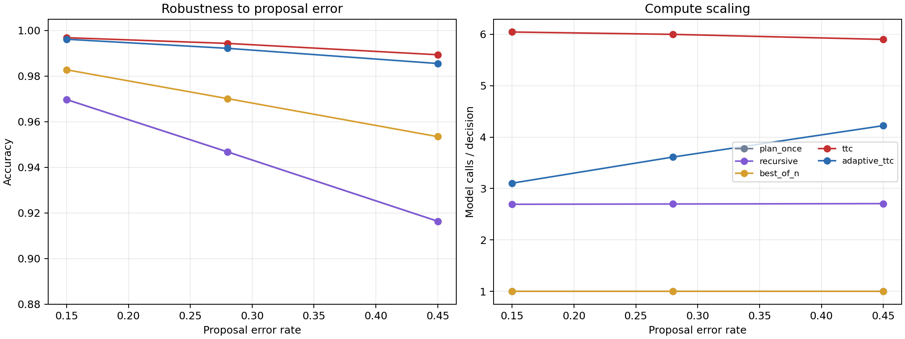
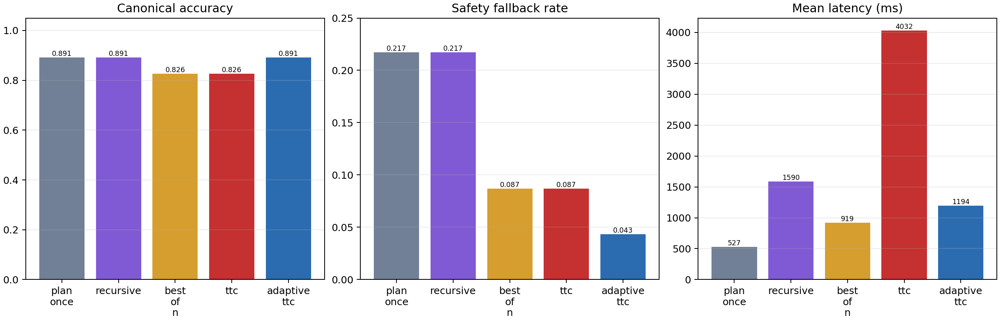
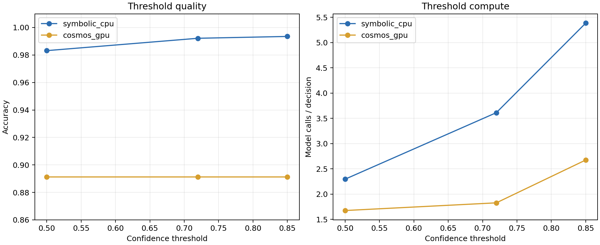

# Subtask planner evaluation report

## Executive result

The recommended configuration remains `adaptive_ttc` with confidence threshold
`0.72`, branching factor `4`, beam width `3`, and depth `3`. On the final standard
symbolic stress run it reaches 99.22% canonical next-subtask accuracy using 3.61
proposal calls per decision. Full TTC reaches 99.43% using 6.00 calls: a 0.21
percentage-point gain for 66% more calls. Adaptive routing is the better default.

On the real open Cosmos-Reason2-2B backend, Adaptive TTC and direct planning both
reach 89.13% canonical accuracy over all 46 decision states. Adaptive TTC reduces
the safety-shield fallback rate from 21.74% to 4.35%, but costs 1.83 versus 1.00
model calls and 1,194 versus 527 ms per decision. Full TTC is worse here (82.61%
canonical accuracy, 4.43 calls, 4,032 ms), so this report does not claim that more
test-time compute automatically improves an open substitute model.

Every Cosmos method has 100% valid-selection rate after the deterministic affordance
shield. Every final symbolic cell has 100% task success, prerequisite-aware progress,
injected-failure recovery, and valid selection. This is a ceiling produced by the
explicit symbolic skill model and recovery shield, not a physical-robot success claim.

## Retained experiment volume

- 510,150 symbolic closed-loop episodes across development, stress, final, and router
  ablation runs; no raw trial was deleted.
- The final robustness matrix contains 210,000 episodes: 6,000 per method at proposal
  error 0.15 and 0.45, and 30,000 per method at error 0.28.
- 742 real Cosmos decision evaluations across smoke, bug-reproduction, pre/post action
  mask, comprehensive, and router-ablation runs; raw generated text is retained.
- One successful 4,004-frame SONIC/Isaac Sim regression plus two retained environment
  setup failures that exposed a stale runtime symlink.

## CPU robustness matrix

Canonical next-subtask accuracy:

| Method | Error 0.15 | Error 0.28 | Error 0.45 |
| --- | ---: | ---: | ---: |
| Plan Once | 96.97% | 94.68% | 91.64% |
| Recursive anticipation | 96.97% | 94.68% | 91.64% |
| Best-of-N | 98.28% | 97.01% | 95.35% |
| Full TTC | 99.68% | 99.43% | 98.93% |
| Adaptive TTC | 99.61% | 99.22% | 98.55% |

At error 0.28, the direct and recursive variants produce the same immediate action;
recursive rollout therefore adds calls without changing immediate accuracy. Best-of-N
improves accuracy by 2.33 points over direct with one batched model call. Full TTC
adds another 2.42 points. Adaptive TTC captures nearly all of that gain with 39.8%
fewer calls than full TTC.

The high-statistics CPU run used all 32 logical CPUs. The retained `mpstat` sample
records 99.66% user time and 0.30% idle; GNU `time` reports 2,318% aggregate CPU over
41.25 seconds including serial result compression and plotting. Raw per-episode traces
are losslessly compressed as `jsonl.gz`.

## Real Cosmos comparison

All values below use the locked snapshot
`9ce19a195e423419c349abfc86fd07178b230561`, all 46 canonical decision states,
method-independent per-state seeds, BF16, TF32, and the same skill mask.

| Method | Accuracy | Valid | Fallback | Calls | Mean latency |
| --- | ---: | ---: | ---: | ---: | ---: |
| Plan Once | 89.13% | 100% | 21.74% | 1.00 | 527 ms |
| Recursive anticipation | 89.13% | 100% | 21.74% | 2.96 | 1,590 ms |
| Best-of-N | 82.61% | 100% | 8.70% | 1.00 | 919 ms |
| Full TTC | 82.61% | 100% | 8.70% | 4.43 | 4,032 ms |
| Adaptive TTC | 89.13% | 100% | 4.35% | 1.83 | 1,194 ms |

The action-mask revision reduced Plan Once fallback from 63.04% to 21.74% and
Adaptive TTC fallback from 56.52% to 4.35%. Canonical accuracy moved from 93.48% to
89.13% because Cosmos more often chose a different currently valid ordering (for
example, closing an open bin before organizing pens). Valid-selection stayed 100%.
The raw trace makes those disagreements reviewable rather than silently marking all
noncanonical orders as unsafe.

During the comprehensive masked run, `nvidia-smi dmon` recorded 348 busy samples:
mean SM utilization 87.25%, maximum 100%, maximum board power 147 W, and maximum
framebuffer allocation 8,389 MiB. PyTorch's peak tensor allocation was 6.13 GiB.

## Router threshold ablation

| Threshold | CPU accuracy | CPU calls | GPU accuracy | GPU calls | GPU TTC route |
| ---: | ---: | ---: | ---: | ---: | ---: |
| 0.50 | 98.32% | 2.29 | 89.13% | 1.67 | 23.91% |
| 0.72 | 99.22% | 3.61 | 89.13% | 1.83 | 26.09% |
| 0.85 | 99.35% | 5.38 | 89.13% | 2.67 | 41.30% |

Threshold 0.72 is retained: relative to 0.50 it improves adverse/noisy proposal
selection substantially, while moving to 0.85 buys only 0.13 additional CPU accuracy
points for 49% more calls. On Cosmos, all three thresholds select the same canonical
answers, and 0.72 adds only 0.15 calls over 0.50.

## SONIC regression

After repairing the stale Isaac Lab `_isaac_sim` symlink to the installed
`/home/shin/isaacsim`, the locked 4,004-frame, two-motion regression completed with:

| Metric | Result |
| --- | ---: |
| Success rate | 1.0000 |
| Progress rate | 1.0000 |
| Failed motions | 0 / 2 |
| Local MPJPE | 23.553 mm |
| Procrustes-aligned MPJPE | 17.314 mm |
| Velocity error | 2.463 mm/frame |
| Acceleration error | 0.804 mm/frame² |

These values exactly match the locked pre-planner baseline. The language planner does
not alter SONIC's 64-dimensional latent interface, 29-joint decoder, or 50 Hz control
loop.

## Interpretation and remaining deployment boundary

The result supports merging the planner infrastructure, task-memory reconciliation,
action masking, safety shield, metric harness, and GR00T language adapter. It does not
support claiming a new end-to-end manipulation success rate. The benchmark world and
value models are symbolic, while the available Cosmos checkpoint is a proposal model,
not the unreleased τ₀ high-level stack.

Before physical G1 deployment, a task-specific `UNITREE_G1_SONIC` GR00T checkpoint,
calibrated perception-to-predicate extractor, manipulation scene/dataset, collision
and joint-limit enforcement, operator stop, and reduced-speed hardware trials remain
required.
