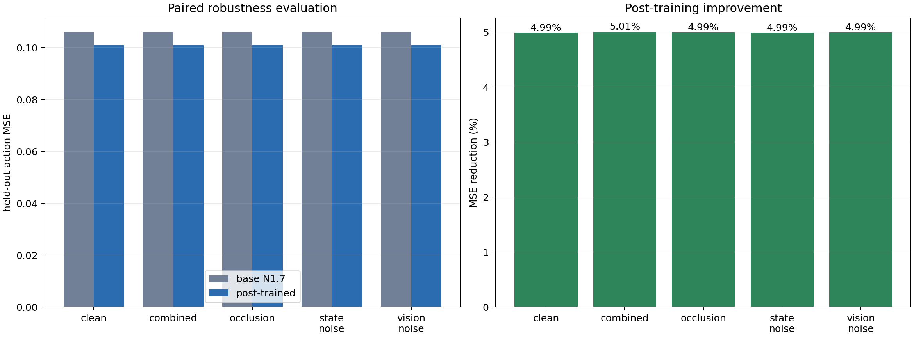
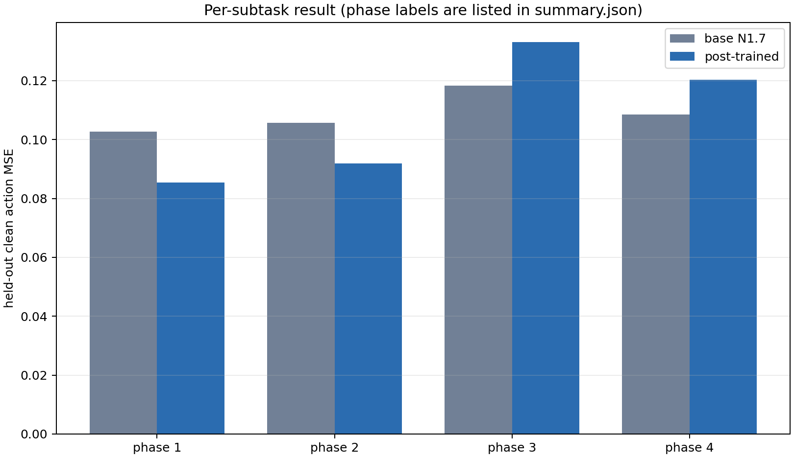
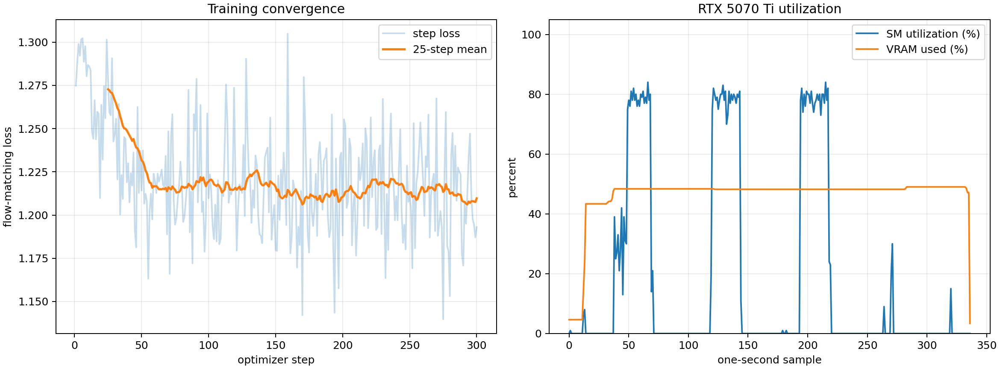
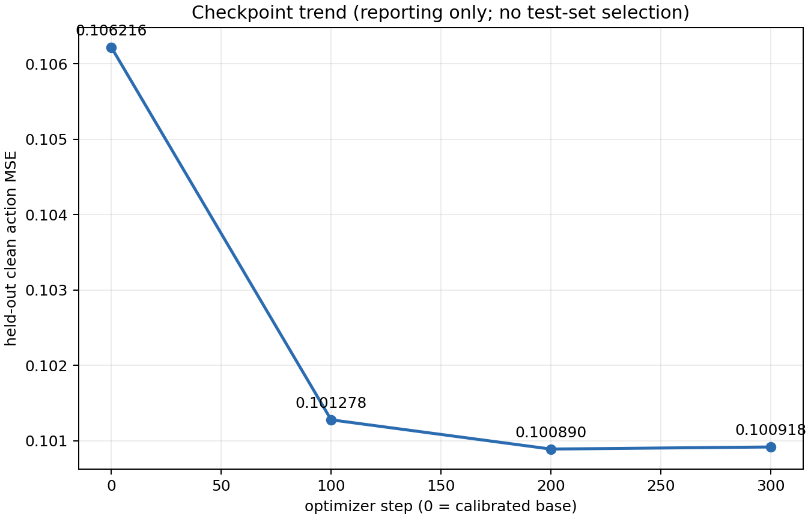
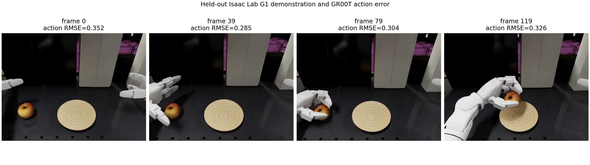
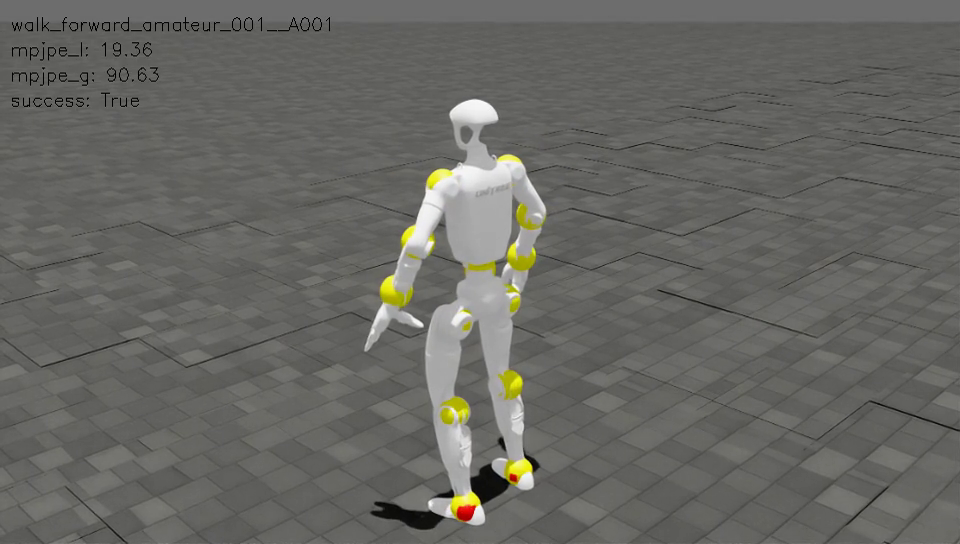

# In-domain subtask VLA post-training

This experiment post-trains the real NVIDIA GR00T N1.7 3B VLA on the robot's
Isaac Lab G1 pick-and-place domain. It starts from commit `75e2dc9` on
`feat(GR00T-ST)/import-sub-task-feature-into-gr00t-sonic`; it is not a synthetic
planner-only benchmark.

## What is trained

The 16 GiB RTX 5070 Ti cannot run NVIDIA's default full GR00T fine-tuning
profile, whose documented minimum is 40 GiB. The memory-bounded profile freezes
the Cosmos vision/language backbone and flow-matching core, casts frozen weights
to BF16, and trains the embodiment-conditioned final action decoder in FP32.
This updates 37,916,800 of 3,144,016,000 parameters (1.206%). The exact tensor
list is retained in
[`trainable_parameters.json`](../results/retraining/subtask/training/trainable_parameters.json).

This is action-decoder adaptation of a VLA checkpoint, not full-backbone VLA
fine-tuning. The launcher patches the official GR00T pipeline only at its model
construction seam and saves standard GR00T checkpoints.

## Dataset and leakage control

The source is NVIDIA's `Arena-G1-Static-PickNPlace-Task` at immutable revision
`37ba80a99486a4c308477854f54b4e82e77777dc`. Its current metadata exposes 208
sparse episode IDs, while the current GR00T loader assumes dense IDs. The data
preparation tool therefore remaps IDs and makes a deterministic episode-level
166/42 train/held-out split (seed 42); no frames from a held-out episode enter
training.

Four horizon-aligned instructions are derived from the left-hand close/release
events for the 40-step action target:

1. approach the apple while maintaining stance;
2. reach and grasp;
3. lift and transport toward the plate;
4. place, release, and retract.

The train split contains 28,154 frames; the held-out split contains 6,912. The
complete episode mapping and phase boundary audit is retained in
[`split_manifest.json`](../results/retraining/subtask/dataset/split_manifest.json).

## Training configuration and utilization

The production run used 300 optimizer steps, batch 4, gradient accumulation 4
(effective batch 16), 28 persistent data-loader processes, fused AdamW, BF16,
TF32, color jitter, state dropout 0.2, and seed 42. `OMP_NUM_THREADS=1` and
`MKL_NUM_THREADS=1` were intentionally set per worker to prevent 28 processes
from each creating nested thread pools. This uses CPU parallelism without
oversubscription.

Measured wall time was 352.54 seconds, trainer throughput 17.927 samples/s, and
maximum process RSS 10.43 GB. The first 25-step mean loss was 1.272740 and the
last was 1.209668 (-4.956%). CPU aggregate busy reached 93.1% (p95 91.195%). GPU
SM reached 84% (p95 80%), board power 185 W, and framebuffer usage 7,991 MiB.
The low whole-run means include model loading, data-shard warm-up, and three
multi-gigabyte checkpoint saves; after warm-up the run was GPU-bound, so making
idle workers spin would not increase throughput.

Raw CPU, per-process, GPU, trainer, and timing logs are checked in under
[`results/retraining/subtask/training`](../results/retraining/subtask/training/).
All three full checkpoints plus the smoke and batch-size probe runs remain under
the locked remote artifact root; none were deleted.

## Held-out results

The calibrated base and checkpoint 300 were evaluated with paired seeds on all
42 held-out episodes, 120 frames each, under clean, Gaussian vision noise,
central occlusion, state noise, and combined corruption. Statistics use the 42
paired trajectory MSE differences, 20,000 bootstrap resamples, an exact sign
test, and paired effect size `dz`.

| Condition | Base MSE | Post-trained MSE | Reduction | Improved | `dz` |
| --- | ---: | ---: | ---: | ---: | ---: |
| Clean | 0.106216 | 0.100918 | 4.988% | 42/42 | 2.336 |
| Vision noise | 0.106230 | 0.100924 | 4.995% | 42/42 | 2.298 |
| Occlusion | 0.106204 | 0.100900 | 4.994% | 42/42 | 2.366 |
| State noise | 0.106216 | 0.100916 | 4.989% | 42/42 | 2.338 |
| Combined | 0.106203 | 0.100884 | 5.008% | 42/42 | 2.371 |

For clean MSE, the mean paired reduction is 0.005298 with bootstrap 95% CI
[0.004613, 0.005975] and exact two-sided sign-test `p=4.55e-13`. Mean clean MAE
falls from 0.196540 to 0.188160, while the fraction of components with absolute
error below 0.1 rises from 0.516541 to 0.536958. Mean inference latency remains
essentially unchanged (53.400 ms to 53.045 ms).

The result is not uniformly better by subtask. Clean, frame-weighted MSE improves
for transport (0.102686 to 0.085473) and place/retract (0.105691 to 0.091878),
but regresses for approach (0.118311 to 0.133187) and grasp (0.108480 to
0.120370). This negative finding is retained rather than hidden. It suggests the
successful demonstration set and phase imbalance favor later manipulation
phases; real recovery/failure demonstrations are needed for the recovery branch.

Checkpoint clean MSE was 0.106216 at step 0, 0.101278 at 100, 0.100890 at 200,
and 0.100918 at 300. All checkpoints are retained. Checkpoint 300 remains the
predeclared final checkpoint; step 200 is not selected after looking at held-out
results.









## Visual and simulator evidence

The held-out evidence combines actual frames from a held-out Isaac Lab G1
demonstration with the corresponding GR00T action error. The MP4 is the source
held-out demonstration, not a rollout generated by the trained policy.



The SONIC integration was separately rerun in Isaac Sim 5.1 with 32 parallel
environments over both bundled 2,002-frame motions. It completed 32/32 runs with
success/progress 1.0, global MPJPE 85.865 mm, local MPJPE 17.285 mm, PA-MPJPE
11.301 mm, acceleration distance 0.763, and velocity distance 2.242. Simulator
GPU utilization reached 71%, using 4,209 MiB. The retained recording is 40
seconds, 500 frames, and 960x544.



The [recorded Isaac Sim rollout](../results/retraining/subtask/isaacsim/sonic_isaacsim_rollout.mp4)
and [machine-readable controller metrics](../results/retraining/subtask/isaacsim/metrics_eval.json)
prove that the locked whole-body controller still executes correctly. They do
not prove closed-loop apple placement by the retrained VLA: the public Arena
demonstrations do not ship the matching closed-loop task environment, and SONIC's
release evaluator accepts motion commands rather than the 43-DoF Arena direct
joint-action contract.

## Reproduction

All immutable inputs and hyperparameters are in
[`subtask_vla_retraining.lock.json`](../config/subtask_vla_retraining.lock.json).
With the model and LeRobot source materialized at the locked paths:

```bash
HRVLA_ROOT=/HELIOS/Robotics/HRVLA
VLA_PYTHON="$HRVLA_ROOT/_vendor/Isaac-GR00T/.venv/bin/python"

"$VLA_PYTHON" scripts/prepare_vla_retraining_data.py \
  --source "$HRVLA_ROOT/_artifacts/datasets/arena-g1-static-pick-place/lerobot" \
  --output-root "$HRVLA_ROOT/_artifacts/datasets/arena-g1-subtask-split"

OMP_NUM_THREADS=1 MKL_NUM_THREADS=1 "$VLA_PYTHON" \
  scripts/train_gr00t_vla_adapter.py \
  --base-model-path "$HRVLA_ROOT/_artifacts/GR00T-N1.7-3B" \
  --dataset-path "$HRVLA_ROOT/_artifacts/datasets/arena-g1-subtask-split/train" \
  --modality-config-path config/g1_arena_subtask_config.py \
  --output-dir "$HRVLA_ROOT/_artifacts/retraining/st-action-decoder-b4-ga4-s300/checkpoints" \
  --max-steps 300 --save-steps 100 --global-batch-size 4 \
  --gradient-accumulation-steps 4 --dataloader-num-workers 28 \
  --learning-rate 5e-5 --seed 42 --color-jitter
```

Use `scripts/evaluate_vla_retraining.py` for a checkpoint and
`scripts/render_vla_retraining_results.py` for paired statistics and plots. Use
`python3 scripts/run_sonic_release.py record --metrics-file <metrics_eval.json>`
to reproduce the evidence video after the SONIC metrics pass.
